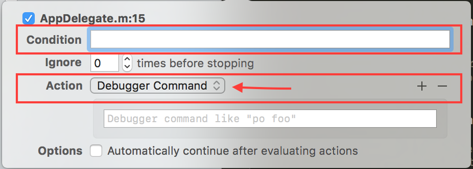
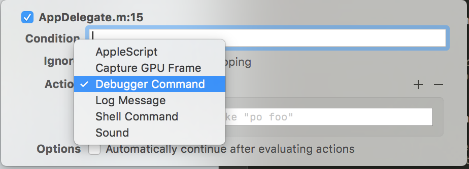
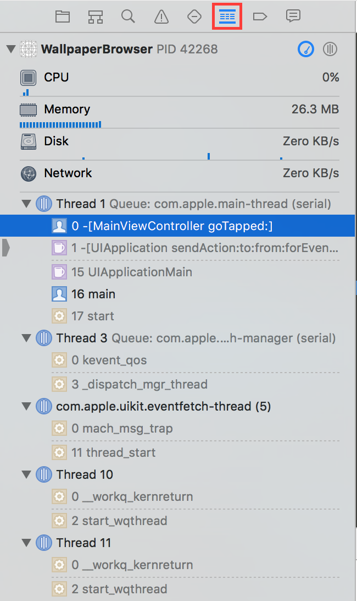
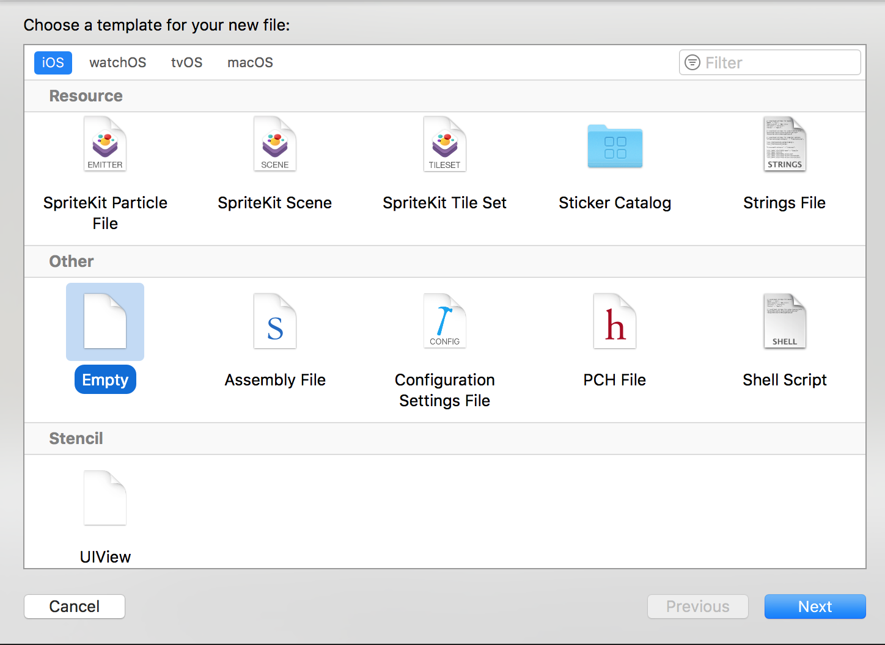
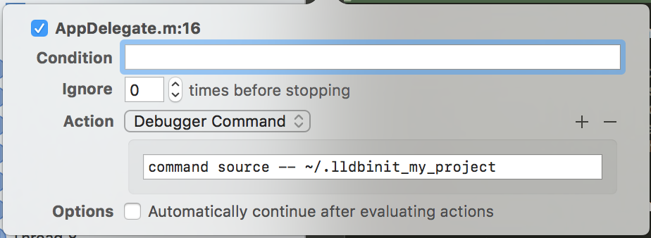

# LLDB


## Summary

* [Impresiones](impresiones.md)

 
### Impresiones
 
Impresion de Objetos (print object):

	po <Object>
	po self.view
	po [helloWordString lowercaseString]

Impresion de Escalares

	(lldb) p (int)[[self myMassiveArray] count]
	3

### Breakpoint comandos

Algunos Comandos

Comando  | Descripcion
|------------- | ------------- |
| (lldb) br l  | Listar los breakpoint |
| (lldb) br delete <indiceBreakPoint> | delete a breakpoint |
| (lldb) br e <indiceBreakPoint> | enable a breakpoint |
| (lldb) br di <indiceBreakPoint> | disable a breakpoint |
| (lldb) b MyViewController.m:30 | set a breakpoint (ojo solo b) |

💡 Los indices dependen de lo que se muestra en la lista de breakpoint `br list`

### Symbolic Breakpoints
Add a symbolic breakpoint:

Ejemplo a los metodos - (void)viewDidLoad

```(lldb) br set -n viewDidLoad```


##### Tener en consideración que en los breakPoint existen 2 importantes características y estas a la vez tienen subcaracterísticas:

1. ***Condition***  `(BOOL)(launchOptions == NULL)`

	1.1. Esto se pone en el 1er combo box	
	
		br modify -c '(BOOL)(launchOptions == NULL)' <#IndiceBreakPoin	
		br mod -c 'self.monthToShow == 1 && !([self.images[1] isEqualToString:@"01.jpg"])' 2




Example of Set a conditional breakpoint:

```
(lldb) b <NombreClase>.m:32
Breakpoint 3: where = [<NombreClase> bla bla bla]
(lldb) br mod -c "totalValue > 1000" 3
```

2. Action  :  `br command add <#> / br com add <#>`

	Subcaracteristicas de Action:
	1. AppleScript	
	2. Capture GPU Frame	
	3. `Debugger Command` // for Default
	4. Log Message	
	5. Shell Command	
	6. Sound
	
		

💡 Por quieres editar un breakpoint (Visualmente) sale por defecto `Debugger Command`

**Run a `debugger command` from a breakpoint**

Ejemplo de como agregar como Action un `Debugger Command` al un breakpoint de indice 2, en este caso un
Run and debugger command from a breakpoint: backTrace:

	(lldb) br com add 2   // Luego de esto aparecera un mensaje: Enter your debugger command(s). Type ‘DONE’ to end;
	Enter your debuger command(s). Type 'DONE' to end.
	> bt // back trace
	> continue
	> DONE

##### Comandos

| Comando  | Accion |
|------------- | -------------|
| (lldb) continue | Resume Execution (play) |
| (lldb) n | Step Over |
| (lldb) s | Step In |
| (lldb) finish | Step Out |

*br  =  breakpoint

### Symbolic BreakPoint: (simbolic): br set -n <method>

	br set -n viewDidLoad
	br set -n prepareForSegue:sender:

#### Ver lista de breakPoint

	br list
💡 For go to exactly place `Shift + Cmd + o` and write `<ClassName.m:<LineNumber>>`

💡 For clear console `Cmd + K`


### Set a Conditional Break Point
	
	1ro establecer el breakpoint:
	(lldb) b BlablaViewController.m:32
	Breakpoint 3: where = bla bla bla
	(lldb) br mod -c “totalValue > 1000” 3. // Para modificar, en este caso comando *3=ID breakpoint
	Otro Ejemplo para modificar el breakpoint de ID 2
	(lldb) br mod -c ‘self.monthToshow == 1 && !([(NSString *)self.images[1] isEquaToString:@”01.jpg”])’ 2
	
**Comprobar esto con: br list  // y ver en la descripcion en la consola los IDs de los breakpoint


-

## Using Expression and variables:

💡 If you use any of  the command option, then you must place `--` at the end of option

```
(lldb) help po
     Evaluate an expression (ObjC++ or Swift) in the current program context, using user defined variables and
     variables currently in scope.
...
'po' is an abbreviation for 'expression -O  -- '
Example: Muestra el mismo resultado
💡 po self.monthToShow	= expr -o -- self.monthToShow
💡 po self.view			= expr -o -- self.view

```

Example:  

	(lldb) expr -L -- 5+5  // Esto genera una variable ($0 o $1 o $<#>) con el valor de 10
	(lldb) expression -- (CGRect)[self.view frame] // expr = expression

⚒ Tambien podemos crear una variable cualquiera:

	(lldb) expr int $monthToShow
	
⚒ Can type “raw” Objetive-C code into LLDB parser which be evaluated in real time.

	(lldb) expr self.view.hidden = YES
	
⚒ Me ha pasado que cuando lo tengo en modo `Debug View Hierarchy` solo tengo la direccion de memoria:
	
	expr ((UILabel *)0x7ff171d05580).hidden = TRUE  // con la direccion
	
⚒ May change a running state of your program

	(lldb) expr self.player.lives = 100
	
⚒ Can be used to log messages to the console 

	(lldb) expr (void) NSLog(@“hello word!”)  // Mensajes en consola
	
⚒ Can call methods on Objets

	(lldb) expr (BOOL) [self.myArray containsObject:@“CarKeys”]
	
⚒ Print out structures in your code

	(lldb) expr -- (CGRect) [self.view frame]
	
⚒ Take “shortcuts” in your app

	(lldb) expr [self prepareForSegue:@“mySegue” sender:nil]
	
⚒ Para asignar cualquier variable interna puedo utilizar de frente expresion

	(lldb) expr <variable> = <Any Value compatible> // Funciona en runtime

#### LLDB Variables: 

💡 Variable names must have a `type` and begin with a `$`

	(lldb) expr int $meaningOfLife = 42
	
⚒ Can be used with other expressions

	(lldb) expr  100 + $meaningOfLife
	
⚒ Some expressions provide results in LLDB variables

	(lldb) $0 = 142
	(lldb) p $0 + 200
	(lldb) $1 = 242

Create and run code on the fly

	(lldb) expr NSString * $json = [self fetchRemoteData];
	
	(lldb) expr NSData * $data = [$json dataUsingEncoding:4]
	
	(lldb) expr NSDictionary * $parsedJson = [[NSJSONSerialization JSONObjectWithData:$data options:0 error:NULL]
	
	(lldb) po parsedData

Otro Ejemplo:

	po [[NSString alloc] initWithData:response.responseData encoding:4]

💡 Un ejemplo de como aplicar esto:

```
1.- Se creo 1ro un br
2.- se le modifico su action
	br com add 1
	> expression [self performSegueWithIdentifier:@"GoToPaper"] sender:nil]
	> continue
	> DONE
3.- Se puso c de continuar
4.- Se simuló la accion para ver los resultados
```

✅ Hubo un ejemplo muy interesante donde en runtime se hizo debug, y se pudo asignar un valor a una variable del sistema, y luego continuar el proceso, lo que llaman `run code on the fly`.


## Backtrace, Thread and Frame

### backtrace
	(lldb) bt      // Muestra la pila de frames del thread actual
	(lldb) bt all  // Muestra todos los threads con sus frames

### thread

	(lldb) thread backtrace			// veo que muestra lo mismo que: bt
	(lldb) thread backtrace all	// veo que muestra lo mismo que: bt all
	
	(lldb) thread list				// Muestra la lista de threads
	
	(lldb) thread select <#>	// Depende a que thread quiere seleccionar
	(lldb) thread select 1
	
	⚒ Continue a certain line (much like a breakpoint)
	(lldb) thread until 100

	⚒ Return from function with custom value
	(lldb) thread return @“Custom Return String”
	
	⚒ Analizar este ejemplo, donde podemos cambiar el retorno de un metodo (En este caso a YES)
	(lldb) thread until <linea de Codigo>
	(lldb) thread return YES	

### frame

	⚒ Inspect local variable in realtime
	(lldb) frame variable
	
	⚒ Para ver una variable particular : frame variable <variable> // Example:
	(lldb) frame variable self
	💡 "frame variable" is not a full expression parser but does support operations like &, *, [], -> 
	
	⚒ Select another frame
	(lldb) frame select 2
	
	⚒ Select a new frame relative to the curretn frame, es genial esto 😜
	(lldb) frame select -relative -1		// Se va al frame anterior del actual
	(lldb) frame select -relative 1		// Se va al frame siguiente del actual	
Remember this example

```
thread until 63
frame variable
thread return YES
n
frame variables
```

Demo 5' 

💡 Para ver visualmente en Xcode los thread con sus frames `Cmd + 6` = `Show the debug navigator`



	

## Watchpoint, Script, Command

### Watchpoint
	(lldb) watchpoint list			// List a watchpoint
	(lldb) watchpoint delete <Id Number Watchpount>
	(lldb) watchpoint delete 1		// Delete a watchpoint	
⚒ Set a watchpoint

	(lldb) watchpoint set variable _x
	
⚒ Add a condition on an address

	(lldb) watchpoint set expression -- my_pointer
	
⚒ Add a condition on a watchpoint

	(lldb) watchpoint modify -c "_x < 0" 1
	
⚒ Remove a condition from a watchpoint

	(lldb) watchpoint modify -c "" 1		
	
💡 Si modificas la condicion de algun `watchpoint`, esto lo puedes ver con el `watchpoint list`.

### Script

💡 LLDB contains an embeddeb Python interpreter

💡 The entery API es exposed through Python scripting bindings

💡 The script commands parses raw Python commands

```
(lldb) script print(sys.version)
2.7.10 (default, Jun 26 2016, 00:32:49) 
[GCC 4.2.1 Compatible Apple LLVM 8.0.0 (clang-800.0.31)]
```

💡 Run phyton scripts from breakpoint

- LLDB creates a Phyton function to encapsulate the scripts
- If you want to access the script variables outside the breakpoint, you must declare them as global variables.

```
	(lldb) breakpoint command add -s python 1  |  br command add <#>
```	
Example:

```
(lldb) script
Python Interactive Interpreter. To exit, type 'quit()', 'exit()'.
>>> print "Hello Word"
Hello Word
>>> exit()
```	
	
### Breakpoint Functions

	def breakpoint_func(frame, bp_loc, session_dictionary):

- frame: 	The current stack frame of the breakpoint
- bp_loc: The current breakpoint location
- dict: 	The python session dictionary


Example:

```
(lldb) breakpoint command add -s python 1
Enter your Python command(s). Type 'DONE' to end.
def function (frame, bp_loc, internal_dict):
    """frame: the lldb.SBFrame for the location at which you stopped
       bp_loc: an lldb.SBBreakpointLocation for the breakpoint location information
       internal_dict: an LLDB support object not to be used"""
    variables = frame.GetVariables(False,True,False,True)
    for i in range(0, variables.GetSize()):
     variable = variables.GetValueAtIndex(i)
     print variable
    DONE
```	

En la siguiente interacion, sale algo asi:

```
(double) i = 0.005833333358168602
(double) m = 72
(double) r = 58.654444222584175
```

```
(lldb) breakpoint command add -F my.breakpoint_func
```

### Command

⚒ Import existing scripts to be used during your debbuging session

	(lldb) command script import ~/my_script.py

⚒ Create a new LLDB command bt calling a Phyton function

	(lldb) command script add -f my_script.python_function cmd_name
	
⚒ Import existing LLDB debugger script

	(lldb) command import ~/my_lldb_commands.txt
	
⚒ Delete uset create alias

	(lldb) command unalias <pf>
	
⚒ Print out command history

	(lldb) command history


#### Example from another file

Se peude crear el archivo python individualmente y luego importarlo:

1.- Crear un empty file

2.- Nombrarlo con un <NameFile>.py



3.- Definimos el contenido del archivo

```
def print_locals(frame, bp_loc, internal_dict):
  varables = frame.GetVariables(False, True, False, True)
  for i in range(0, variables.GetSize()):
    variable = variables.GetValueAtIndex(i)
    print variable
```    
	
4.- Poner un Breakpoint donde sea conveniente

5.- tener en memoria la ruta del archivo python, esto lo encontramos en `shwo thw file inspector`

6.- Ejecutar la App y cuando se detenga en el breakpoint, ejecutar el siguien comando;

```
(lldb) command script import "La/Ruta/del/File/De/Phyton.py"
```

7.- En este punto el archivo esta importado en my script

8.- Mediate el comando `breakpoint list` podemos ver en que `breakpoint` atacharlo

9.- Tener en cuenta que la funcion se llama con el `breakpoint.<Nombre Del Metodo> <Id breakpoint>`

```
(lldb) breakpoint command add -F breakpoint.print_locals 4
```

10.- Esto lo podemos ver reflejado con el comando `breakpoint list`, cuando ejecutemos y llegue a este breakpoint, deberia verse ejecutado este script

-


💡 `def <name method>`   // definir metodo en python

### Finding Help and Creating Aliases

#### LLDB Commands Syntax

`<command>` `<action>` `[options]` `[arguments]`

⚒ -

	(lldb) breakpoint set --selector speakAgain
	
	(lldb) process launch --stop-at-entry -- -prorgam_arg1 value
	
⚒ Options can be placed anywhere

⚒ For arguments that are preceded with a " - ", separate the options from the arguments with " -- "

⚒ Quotes can protect spaces

⚒ Quotes can be escaped: "\"

⚒ Some commands are unparsed after options.
	(script and expression)
	
#### Three Syntax Forms

Discoverable form

	(lldb) expression --objective-description -- myString
	
Abbreviated form

	(lldb) e -O -- myString
	
Alias

	(lldb) po myString		

### Asking for Help

	(lldb) help watchpoint
	(lldb) help watchpoint set
	(lldb) help <byte-size>
	(lldb) help po
	(lldb) help -a

```	
(lldb) aproppos break

The following commands may relate to 'break':
  _regexp-break                         -- Set a breakpoint using one of
                                           several shorthand formats.
  _regexp-tbreak                        -- Set a one-shot breakpoint using one
                                           of several shorthand formats.
  breakpoint                            -- Commands for operating on
                                           breakpoints (see 'help b' for
                                           shorthand.)
  breakpoint clear                      -- Delete or disable breakpoints
                                           matching the specified source file
                                           and line.
  breakpoint command                    -- Commands for adding, removing and
                                           listing LLDB commands executed when
                                           a breakpoint is hit.
  breakpoint command add                -- Add LLDB commands to a breakpoint,
                                           to be executed whenever the
                                           breakpoint is hit.  If no breakpoint
                                           is specified, adds the commands to
                                           the last created breakpoint.
  breakpoint command delete             -- Delete the set of commands from a
                                           breakpoint.
  breakpoint command list               -- List the script or set of commands
                                           to be executed when the breakpoint
                                           is hit.
  breakpoint delete                     -- Delete the specified breakpoint(s). 
                                           If no breakpoints are specified,
                                           delete them all.
  breakpoint disable                    -- Disable the specified breakpoint(s)
                                           without deleting them.  If none are
                                           specified, disable all breakpoints.
  breakpoint enable                     -- Enable the specified disabled
                                           breakpoint(s). If no breakpoints are
                                           specified, enable all of them.
  breakpoint list                       -- List some or all breakpoints at
                                           configurable levels of detail.
  breakpoint modify                     -- Modify the options on a breakpoint
                                           or set of breakpoints in the
                                           executable.  If no breakpoint is
                                           specified, acts on the last created
                                           breakpoint.  With the exception of
                                           -e, -d and -i, passing an empty
                                           argument clears the modification.
  breakpoint name                       -- Commands to manage name tags for
                                           breakpoints
  add                                   -- Add a name to the breakpoints
                                           provided.
  delete                                -- Delete a name from the breakpoints
                                           provided.
  list                                  -- List either the names for a
                                           breakpoint or the breakpoints for a
                                           given name.
  breakpoint read                       -- Read and set the breakpoints
                                           previously saved to a file with
                                           "breakpoint write".  
  breakpoint set                        -- Sets a breakpoint or set of
                                           breakpoints in the executable.
  breakpoint write                      -- Write the breakpoints listed to a
                                           file that can be read in with
                                           "breakpoint read".  If given no
                                           arguments, writes all breakpoints.
  renderscript kernel                   -- Commands that generate breakpoints
                                           on renderscript kernels.
  renderscript kernel breakpoint all    -- Automatically sets a breakpoint on
                                           all renderscript kernels that are or
                                           will be loaded.
                                           Disabling option means breakpoints
                                           will no longer be set on any kernels
                                           loaded in the future, but does not
                                           remove currently set breakpoints.
  renderscript kernel breakpoint set    -- Sets a breakpoint on a renderscript
                                           kernel.
  renderscript reduction breakpoint     -- Commands that manipulate breakpoints
                                           on renderscript general reductions.
  renderscript reduction breakpoint set -- Set a breakpoint on named
                                           RenderScript general reductions
  b                                     -- Set a breakpoint using one of
                                           several shorthand formats.
  rbreak                                -- Sets a breakpoint or set of
                                           breakpoints in the executable.
  tbreak                                -- Set a one-shot breakpoint using one
                                           of several shorthand formats.

The following settings variables may relate to 'break': 

  target.move-to-nearest-code -- Move breakpoints to nearest code.
  target.skip-prologue -- Skip function prologues when setting breakpoints by
                          name.
  target.breakpoints-use-platform-avoid-list -- Consult the platform module
                                                avoid list when setting
                                                non-module specific
                                                breakpoints.
  target.inline-breakpoint-strategy -- The strategy to use when settings
                                       breakpoints by file and line. Breakpoint
                                       locations can end up being inlined by
                                       the compiler, so that a compile unit
                                       'a.c' might contain an inlined function
                                       from another source file. Usually this
                                       is limited to breakpoint locations from
                                       inlined functions from header or other
                                       include files, or more accurately
                                       non-implementation source files.
                                       Sometimes code might #include
                                       implementation files and cause inlined
                                       breakpoint locations in inlined
                                       implementation files. Always checking
                                       for inlined breakpoint locations can be
                                       expensive (memory and time), so if you
                                       have a project with many headers and
                                       find that setting breakpoints is slow,
                                       then you can change this setting to
                                       headers. This setting allows you to
                                       control exactly which strategy is used
                                       when setting file and line breakpoints.
  target.process.ignore-breakpoints-in-expressions -- If true, breakpoints will
                                                      be ignored during
                                                      expression evaluation.
  plugin.jit-loader.gdb.enable-jit-breakpoint -- Enable breakpoint on
                                                 __jit_debug_register_code.
```

-

### Creating an Alias

-

#### Positional Aliases:

💡 Provides simple substitutions

💡 Additional arguments are appended to the end

```
(lldb) command alias <alias-name> <substitute>
```

💡 Ability to position arguments in the command line

💡 % in the command line will match the argument
    
```
(lldb) command alias sbr breakpoint set -l %1
```
	
#### Regular Expression Aliases:

💡 Alias arguments are matched against a regular expression

💡 Multiple regular expression may be included

💡 First regular expression match wins

```
(lldb) command regex sbr 's/([0-9]+)/breakpoint set -l %1/'
```

#### Creating global aliases

💡 Save LLDB commands in file: `~/.lldbinit`

#### Creating project aliases

💡 Save LLDB commands in file: `~/.lldbinit_my_project`

💡 Create new breakpoint with the following LLDB command:



#### Demo: Revealing the Data

💡 Demostrate positional alias

💡 Demostrate regex alias

💡 Show how to persist aliases between debugging sessions

#### Demo: 

```
(lldb) help
(lldb) help breakpoint
(lldb) help breakpoint set
(lldb) help <address-expression>
(lldb) apropos breakpoint
```

💡 Crearemos un alias para

```
expression (CGRect)[self.view frame]
```

este sería:

```
(lldb) command alias pf expr (CGRect) [self.view frame]
```

Y ahora lo podemos utilizar como:

```
(lldb) pf
(CGRect) $1 = (origin = (x = 0, y = 0), size = (width = 320, height = 480))
```

🚦 Esto funciona solo en el debugging session.

💡 Crearemos un alias utilizando regular expresion (regex)

```
(lldb) command regex pf
Enter one of more sed substitution commands in the form: 's/<regex>/<subst>/'.
Terminate the substitution list with an empty line.
> s/(.+)/expr (CGRect)[%1 frame]/
> s/^$/expr (CGRect)[self.view frame]/
> 
(lldb) pf
(CGRect) $2 = (origin = (x = 0, y = 0), size = (width = 320, height = 480))
(lldb) pf self.button
(CGRect) $3 = (origin = (x = 137, y = 269), size = (width = 46, height = 30))
```

#### Demo de hacer persistente los alias: 

💡 Crearemos un archivo con el nombre de `.lldbinit` en  `/Users/<tuUser>/.lldbinit`

con este contenido, luego salir y volver ingresar al Xcode.

```
command script import /usr/local/opt/chisel/libexec/fblldb.py
command regex pf 's/(.+)/expr (CGRect)[%1 frame]/' 's/^$/expr (CGRect) [self.view frame]/'
command alias pjson expression -O -- [NSString alloc] initWithData:responseData encoding:4]
```


type summary add -P CGRect
type format add
type filter add
type category list
type filter list
type summary list


Chisel:
https://github.com/facebook/chisel

border self.view

expr (void) [self.view setHidden:YES]  = hide self.view
show self.view  // para mostrar la vis
caflush   // para actualizar la vista en caso (en el eje que no se oculta en real time)
border self.view
border - - color orange  self.view
border [self.navigationItem titleView]
border --color orange [self.navigationItem titleView]
mask [self.navigationItem titleView]
unmask [self.navigationItem titleView]

**pca (print core animation)
pviews

vs self.view  // Para salir la opción q

presponder self.view

visualize self.view

help -a

help <Any>


**Cuando tengo en modo debug view Hierarchy: puedo acceder a travez de su dirección
po ((UILabel *)0x7ff171d05580).text


QuickLook
https://github.com/ryanolsonk/LLDB-QuickLook

Ima25
RJu17

[Pagina Oficial: The LLDB Debugger](https://lldb.llvm.org/)


